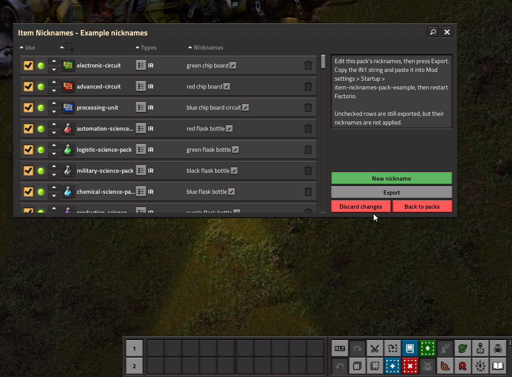

# Item Nicknames: Example Pack

Optional companion for **[Item Nicknames](https://mods.factorio.com/mod/item-nicknames)**. Ships a starter set of search aliases for common vanilla and Space Age prototypes: circuits as chip boards, science packs as colored flasks, and similar shortcuts you can keep, edit, or remove.

Requires **Item Nicknames**. **Space Age** is optional; rows for Space Age-only prototypes are ignored when that expansion is not enabled.

## Quick start

1. Enable **Item Nicknames** and **Item Nicknames: Example Pack**.
2. Restart Factorio so startup settings apply.
3. Search in crafting, Factoriopedia, or the technology list using the example aliases (for example search **chip** for circuits or **fulgora** for Fulgora-related tech).

The pack is on by default through the startup setting **Example nicknames** (`item-nicknames-pack-example`).

## Editing or disabling the pack

1. Open **Item Nicknames** from the shortcut bar.
2. Click **Nickname packs**, then **Example nicknames**.
3. Change rows, or uncheck rows you do not want applied.
4. Press **Export**, copy the IN1 string.
5. Paste into **Settings → Mod settings → Startup → Example nicknames** and restart.

To disable only this pack, clear that startup setting (or paste an empty value) and restart. Your **Custom Nicknames** from the core mod are unchanged.

Pack nicknames merge with your personal list; they do not remove tokens you added under **Custom Nicknames**.

## Screenshot

## Search examples

With the example pack enabled you can try aliases such as:

- **chip** — electronic and advanced circuits, processing units
- **flask** — science packs
- **fulgora** — Fulgora-related technologies (Space Age)
- **ham** — holmium plate (Space Age)

Exact coverage depends on which expansions and mods you have enabled.

## Source and issues

Pack data and updates are maintained on [GitHub](https://github.com/djfariel/item-nicknames-example). Format and API details are in the core mod repository.
